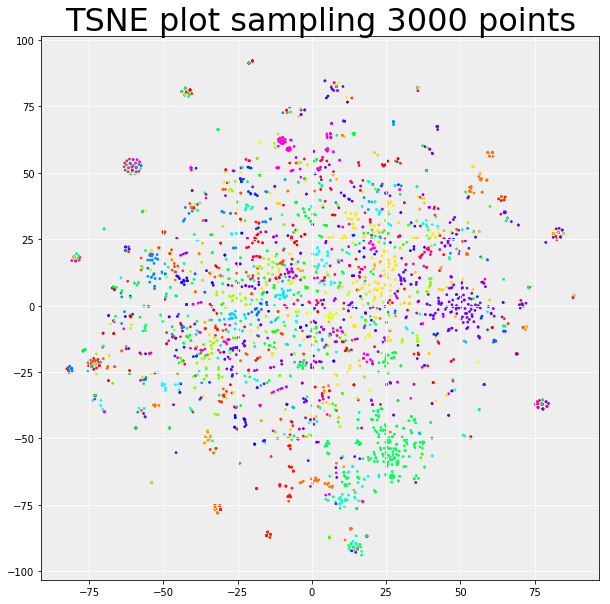

# Equation Mapping: Statistics

Here we will derive vectors based on equations from [statistics topics](https://en.wikipedia.org/wiki/List_of_statistics_articles). You should have already installed the required python
modules in [requirements.txt](../requirements.txt). 

I first started with these steps in separate files, but I find it easier to provide one cohesive 
analysis file, now represented at [statisticsAnalysis.py](statisticsAnalysis.py). The goal of this 
step is to build a word2vec model that has character vectors derived from a huge corpus
of equations.

## Overall Strategy

The general goal is to:

 1. Create a word2vec model using (some set) of equations from wikipedia
 2. Use the character (latex token) embeddings to map a set of topics (via their equations) to the model space 
 3. compare similarity of the topics

For a first shot, I did all of the above with *just* the statistics articles, however
while I think this would build a good model of the character relationships (over 66K equations present!)
there isn't enough specificity for kinds of math equations in the articles, so you get a clustering
(TSNE) that looks like this:



This likely means that the articles each have a varied set of equation types (which is logical) 
with a few articles representing a specific kind of math equation (the cleaner clusters around the
outside). What that tells us is that while the model might be good as a base, we need to
generate topic equation embeddings from a more meaningful set. This second set (portion of work)
is in the  [math](../math) directory. Here we will continue to describe generating the overall 
model.


## 1. Create List of Statistics Articles

We first need a crapton of wikipedia pages to parse equations from. This means
getting a list of links from the [statistics topics](https://en.wikipedia.org/wiki/List_of_statistics_articles) 
page, and then (manually) disambiguating the terms when appropriate. These manual
steps are now preserved in the code to be reproducible.

At the end of this step, we have a list of final articles (wikipedia pages) we will
use for the model in [wikipedia_statistics_articles.txt](wikipedia_statistics_articles.txt).

## 2. Obtain Articles and Metadata

From our list of articles above, we now want to populate a lookup dictionary
with metadata about each article. This step pulls the entire page from Wikipedia,
and saves fields such as links, images, url, etc. This is the starting data
structure we need to keep in the case of needing to go back and redo any
portions of the analysis.

At the end of this procedure we will have a [wikipedia_statistics_articles.json](wikipedia_statistics_articles.json) 
and matching [wikipedia_statistics_articles.pkl](wikipedia_statistics_articles.pkl) to each
store the same data structure. 

## 3. Equation Extraction

From our articles, the equations are represented as an attribute of an image.
Wikipedia does this because browsers that don't support MathJax (or similar)
can fall back to showing the image itself. We can take advantage of this
and find the images having a particular class, and then extracting the raw
latex from it. We thus:

 1. use BeautifulSoup to parse the raw html of each article (subpage)
 2. find equations in images based on their class
 3. save the equations, and image, to an equations data structure organized by the topic page

Here is an example of an entry in the list of equations

```python
  {'png': 'https://wikimedia.org/api/rest_v1/media/math/render/svg/b7c3ba47cc5436c389f86a3f617a191d0dbe4877',
   'tex': '2^{n\\mathrm {H} (k/n)}'},
```

At the end of this step, we have a data structure with indices as article name,
and indexing into a list of equations that were extracted. We save both as
[wikipedia_statistics_equations.json](wikipedia_statistics_equations.json) and
[wikipedia_statistics_equations.pkl](wikipedia_statistics_equations.pkl).

## 4. Word2Vec Model

The first step here was to extract "sentences" of the equations, meaning a text
file of equation "sentences," where each sentence is a set of characters (or LaTeX symbol)
delimited by white spaces. This was first done by way of calling the 
[helpers](helpers.py) function `extract_tokens`, but ultimately done by the
same function integrated into the class `TrainEquations` now a part of wordfish.
Before we run `TrainEquations`, we have saved a single file with every extracted equation sentence, [equation_statistics_sentences.txt](equation_statistics_sentences.txt), and one for the labels, 
[equation_statistics_labels.txt](equation_statistics_labels.txt), respectively.

With these sentences, I could then use the `TrainEquations` method from wordfish
to break apart the equation sentences by single character or LaTex symbol (e.g., `/begin`)
and then build the Word2Vec model from it.

After this step we have:

 - [word2vec models](models) to describe either the entire wikipedia corpus, or subset of domains (pages)
 - [vectors of the embeddings](vectors) that represent the embeddings for the tokens, or individual characters


## Next step

Our next step is to map the math equations to this embedding space. See the [analysis](../analysis)
folder for doing this.
